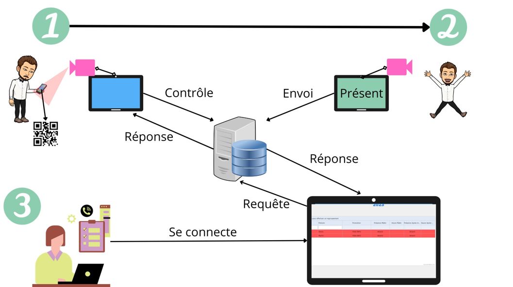
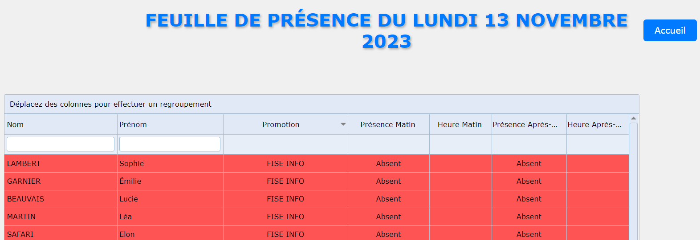
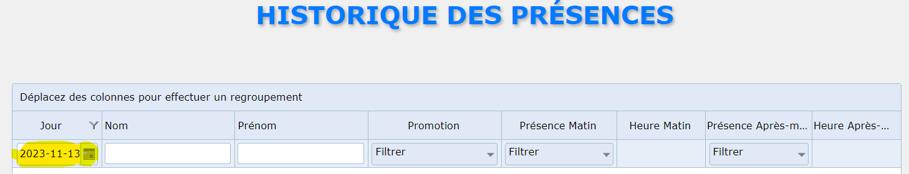
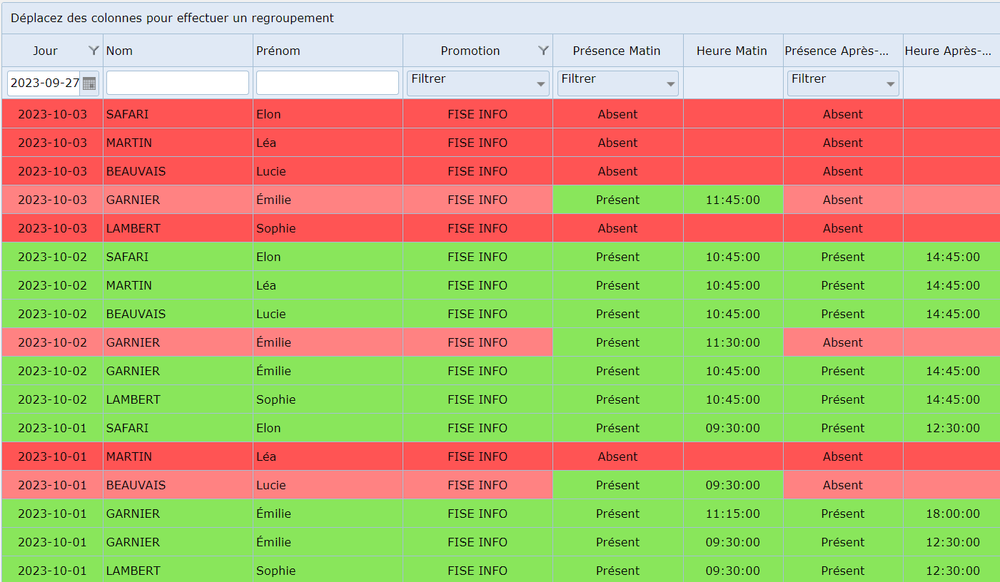
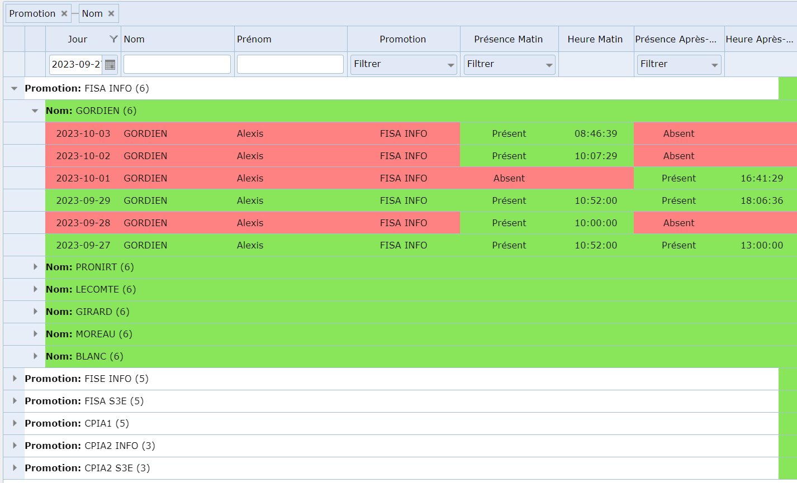

# Contexte
Ce projet fait référence au projet de numérisation de la feuille d'émargement au sien de mon école d'ingénieurs

## Fonctionnement

### Système de pointage
Premièrement, il faut comprendre que ce système est basé sur un pointage avec un lecteur de QR code.
Chaque étudiant possède un QR code unique qu'il viendra pointer 2 fois par jour (une présence le matin, une l'aprem) auprès du QR code.

Le controlleur qui contient le QRCode controle aussi les présences (faux QRcode, multiples présences etc...)
Une fois le contrôle réalisé, il va inscrire le pointage de l'élève dans une BDD dont les données seront accessibles depuis le programme que vous pouvez utiliser.

Voici un schéma qui explique la situation : 

Pour voir le programme du controlleur, vous pouvez y accéder en allant vers ce lien [controlleur](./private/controller.py)
### Environnements utilisés
Pour réaliser ce projet, j'ai utilisé les environnements suivants :
+ Apache
+ Mysql
+ PHP
  
Pour ceux qui sont intéressés, vous pouvez avoir le tout en 1 en téléchargeant par exemple XAMPP via la lien suivant :
#### Lien vers le téléchargement de XAMPP
> https://www.apachefriends.org/fr/download.html

Pour cette exemple de projet, vous n'avez pas besoin d'utiliser une BDD ou Apache, seul PHP est nécessaire.

Lien pour télécharger PHP : 

> https://www.php.net/downloads.php

#### Utilisation de jQWidgets

jQWidgets est un framework logiciel avec des widgets (éléments de contrôle graphiques), des thèmes, une validation des entrées, un plug-in glisser-déposer, des adaptateurs de données, une accessibilité WAI-ARIA intégrée, une internationalisation et une prise en charge MVVM. Il est construit sur les normes et technologies ouvertes HTML5, CSS, JavaScript et jQuery. Cette bibliothèque est utilisée pour développer des applications Web et mobiles réactives. Certains développeurs considèrent jQWidgets comme l'une des meilleures alternatives à l'interface utilisateur jQuery open source.

C'est cette librairie qui m'a permis de visualiser facilement des données et de pouvoir les arranger comme bon me semble (uniquement en front).

La bibliothèque est stockée [ici](./
### Base de données

# Utilisation

## Lancement du serveur PHP

Avant d'ouvir votre fichier html, placez vous dans le dossier principale (pointage_exemple) et lancez la commande suivante : 

`php -S localhost:8000`

Cette commande va lancer un serveur PHP, cliquez sur le lien généré pour découvrir le projet.

## Connexion

Pour accéder aux présences, il vous faut d'abord vous connecter, car il y a un minimum de sécurité.
Pour vous connecter, utilisez celui-ci :
+ Utilisateur : admin
+ mot de passe : admin

Vous pouvez retrouver la liste des noms d'utilisateurs et les mots de passses (chiffrés) qui sont stockés dans [data](data/data-admin.php)

Il est évident que ces données dans le projet réel sont stockées en Base et que le mot de passe est chiffré, vous ne pouvez pas y accéder aussi facilement.

## Présence du jour

La fonctionnalité de présence du jour n'est pas très intéressante dans cet exemple puisqu'elle utilise des données brutes qui ne peuvent pas être mises à jour facilement, mais vous pouvez tout de même y accéder.
Pour ce faire sélectionnez la promotion que vous souhaitez observer, puis cliquez sur le bouton "Accéder aux présences du jour" :

Une fois le formulaire validé, vous basculerez vers une page php qui récapitule les présences des étudiants du jour sur la promotion choisie.

## Liste des élèves

Cliquez sur le bouton "Liste des élèves" et vous accèderez à un tableau qui référence tous les élèves. Le datagrid réalisé avec jQWidgets vous permet de filtrer comme bon vous semble.

## Historique des présences

L'historique des présences me semble être le programme le plus intéressant car il permet de retracer toutes les présences depuis la création du projet. Pour cet exemple, j'ai initialisé les jours de présence depuis le 1er janvier 2023 et les données sont alimentée en fin septembre 2023.
Lorsque vous allez cliquez sur l'historique des présence, le programme est filtré afin qu'il affiche par défaut la liste des présences de tout le monde sur la semaine courante : 
+ Si nous sommes mardi, alors il affiche par défaut les présences de lundi et mardi
+ Si nous sommes vendredi, il affichera par défaut la semaine

Bien sûr, vous pouvez modifier la date en jouant avec la plage de date ici : 

D'ailleurs, il serait intéressant pour vous de changer la plage de date pour vérifier que les présences des élèves remontent correctement.
Sélectionnez la plage de date du 27 septembre au 3 octobre et vous aurez des présences et des absences :

Comme il est possible d'avoir beaucoup de données dans tous les sens, je vous invite à utiliser la fonction proposée par jQWidgets qui permet de regrouper les données :

1. Attrapez la colonne des promotions et glissez là dans la barre où il y a le texte "Déplacez des colonnes pour effectuer un regroupement"
2. Attrapez la colonne des nom et faite la même chose

Une fois la manipulation faite, vous devriez avoir un tableau ressemblant à ceci :

C'est plus simple pour exploiter les données n'est-ce pas ?

# Idées d'amélioration
