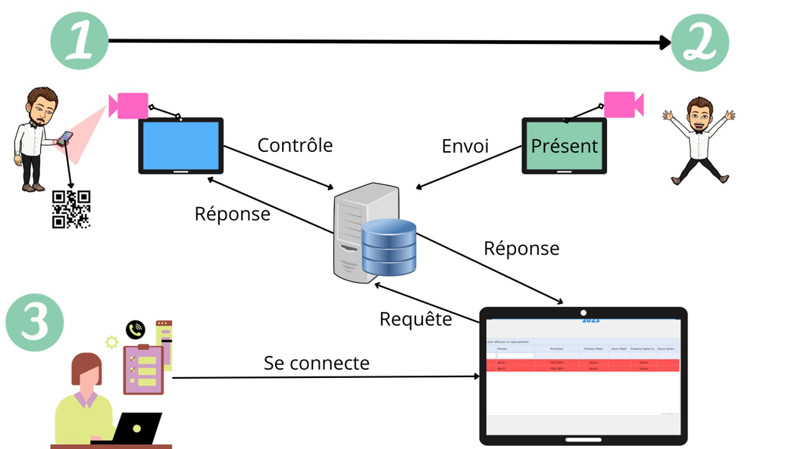
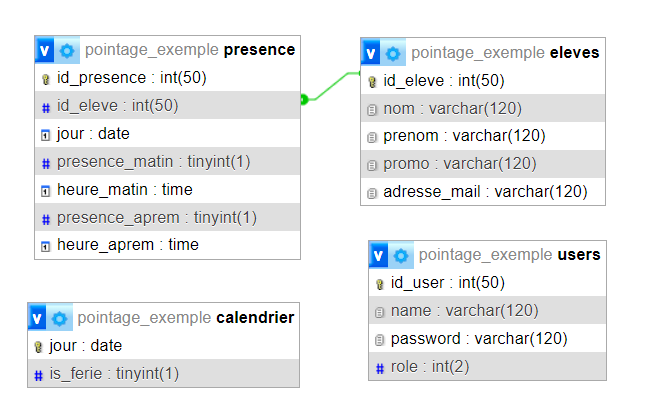
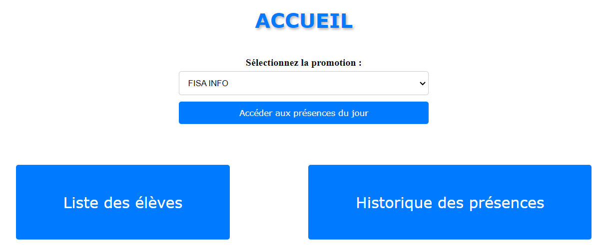
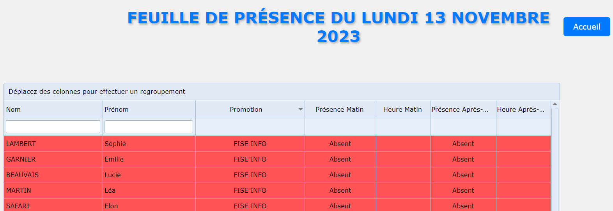
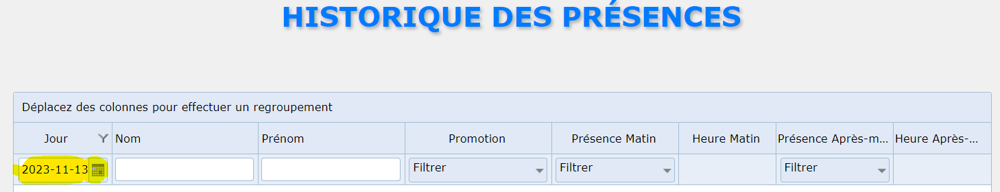
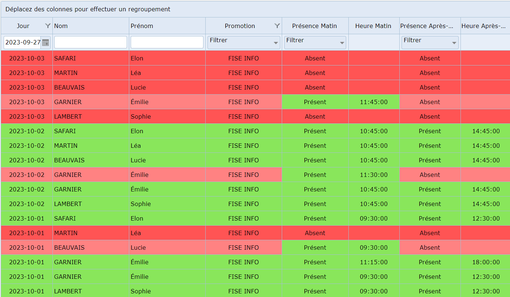
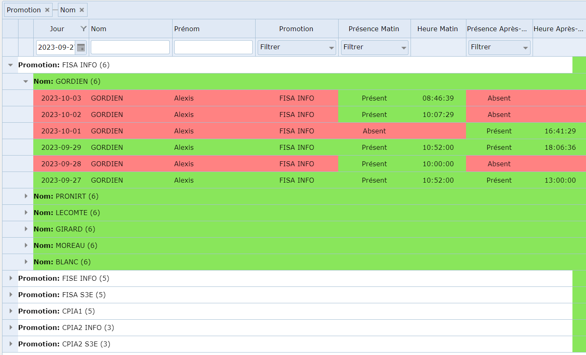

[French part](#french)
[English part](#english)

# English
# Context
This project refers to the project of digitizing the attendance sheet within my engineering school

## Operation

### Pointing system
First, it is necessary to understand that this system is based on a pointing with a QR code reader.
Each student has a unique QR code that he will come to point twice a day (one presence in the morning, one in the afternoon) with the QR code.

The controller that contains the QRCode also controls the presences (false QRcode, multiple presences etc ...)
Once the control is carried out, it will enter the student's pointing in a BDD whose data will be accessible from the program that you can use.

Here is a diagram that explains the situation:

### Environments used
To carry out this project, I used the following environments:
+ Apache
+ Mysql
+ PHP

For those who are interested, you can have everything in 1 by downloading for example XAMPP via the following link:
#### Link to download XAMPP
> https://www.apachefriends.org/fr/download.html

For this example project, you do not need to use a BDD or Apache, only PHP is necessary.

PHP download link:

> https://www.php.net/downloads.php

#### Using jQWidgets

jQWidgets is a software framework with widgets (graphical control elements), themes, input validation, drag-and-drop plugin, data adapters, built-in WAI-ARIA accessibility, internationalization and MVVM support. It is built on open standards and technologies HTML5, CSS, JavaScript and jQuery. This library is used to develop responsive web and mobile applications. Some developers consider jQWidgets as one of the best alternatives to the open source jQuery UI.

This library is what allowed me to easily visualize data and be able to arrange it as I want (only on the front end).

The library is stored [here](./jQWidgets)

### Database

Although the use of the database is not present in this example, it seems important to me to explain the content and the relationships made in this database.

Here is the data model:

# Usage

## Launching the PHP server

Before opening your html file, go to the main folder (pointage_exemple) and launch the following command:

`php -S localhost:8000`

This command will launch a PHP server, click on the generated link to discover the project.

## Connection

To access the presences, you must first connect, because there is a minimum of security.
To log in, use this one:
+ User: admin
+ password: admin

You can find the list of usernames and passwords (encrypted) that are stored in [data](data/data-admin.php)

It is obvious that this data in the real project is stored in the Database and that the password is encrypted, you cannot access it as easily.

## Attendance of the day

The attendance of the day feature is not very interesting in this example since it uses raw data that cannot be updated easily, but you can still access it.
To do this, select the class you want to observe, then click on the "Access attendance of the day" button:

Once the form is validated, you will switch to a php page that summarizes the attendance of the students of the day on the chosen class.

## Student List

Click on the "Student List" button and you will access a table that references all students. The datagrid made with jQWidgets allows you to filter as you wish.

## Attendance History

The attendance history seems to me to be the most interesting program because it allows you to trace all attendances since the creation of the project. For this example, I initialized the days of attendance since January 1, 2023 and the data is fed at the end of September 2023.
When you click on the attendance history, the program is filtered so that it displays by default the list of everyone's attendance for the current week:
+ If it is Tuesday, then it displays by default the attendances of Monday and Tuesday
+ If it is Friday, it will display by default the week

Of course, you can change the date by playing with the date range here:

Moreover, it would be interesting for you to change the date range to check that the students' attendances are going back correctly.
Select the date range from September 27 to October 3 and you will have attendances and absences:

Since it is possible to have a lot of data in all directions, I invite you to use the function proposed by jQWidgets which allows you to group the data:

1. Grab the promotions column and drag it into the bar where there is the text "Move columns to group"
2. Grab the names column and do the same thing

Once the manipulation is done, you should have a table looking like this:

It's easier to use the data, isn't it?

# Ideas for improvement

Although this project is already effective and allows to free oneself from the "physical" side of the presence witness and to keep the data and better exploit it, it can happen that the QRCode reader encounters problems, or that there is a waiting time to be able to scan its QRCode. It could be interesting to place the same controllers in several places in order to smooth the traffic.

## Bring this project to the internet

It could be interesting to go beyond the private server of the engineering school and bring the project to the internet in order to create for example an application so that students with their phones can report their presence while having access to their attendance summaries too.

However, bringing this project requires more thought and authorization:

+ The school's policies must agree with the export of data elsewhere than at home
+ It must be taken into account that if students can "clock in" on their phone remotely, they can clock in without actually being present. A presence check by a superior would be recommended.

If this project can be taken further, it would be a great new task that I would be happy to share on my Github.

# French
# Contexte
Ce projet fait référence au projet de numérisation de la feuille d'émargement au sien de mon école d'ingénieurs

## Fonctionnement

### Système de pointage
Premièrement, il faut comprendre que ce système est basé sur un pointage avec un lecteur de QR code.
Chaque étudiant possède un QR code unique qu'il viendra pointer 2 fois par jour (une présence le matin, une l'aprem) auprès du QR code.

Le contrôleur qui contient le QRCode controle aussi les présences (faux QRcode, multiples présences etc...)
Une fois le contrôle réalisé, il va inscrire le pointage de l'élève dans une BDD dont les données seront accessibles depuis le programme que vous pouvez utiliser.

Voici un schéma qui explique la situation : 

Pour voir le programme du contrôleur, vous pouvez y accéder en allant vers ce lien [contrôleur](./private/controller.py)
### Environnements utilisés
Pour réaliser ce projet, j'ai utilisé les environnements suivants :
+ Apache
+ Mysql
+ PHP
  
Pour ceux qui sont intéressés, vous pouvez avoir le tout en 1 en téléchargeant par exemple XAMPP via la lien suivant :
#### Lien vers le téléchargement de XAMPP
> https://www.apachefriends.org/fr/download.html

Pour cette exemple de projet, vous n'avez pas besoin d'utiliser une BDD ou Apache, seul PHP est nécessaire.

Lien pour télécharger PHP : 

> https://www.php.net/downloads.php

#### Utilisation de jQWidgets

jQWidgets est un framework logiciel avec des widgets (éléments de contrôle graphiques), des thèmes, une validation des entrées, un plug-in glisser-déposer, des adaptateurs de données, une accessibilité WAI-ARIA intégrée, une internationalisation et une prise en charge MVVM. Il est construit sur les normes et technologies ouvertes HTML5, CSS, JavaScript et jQuery. Cette bibliothèque est utilisée pour développer des applications Web et mobiles réactives. Certains développeurs considèrent jQWidgets comme l'une des meilleures alternatives à l'interface utilisateur jQuery open source.

C'est cette librairie qui m'a permis de visualiser facilement des données et de pouvoir les arranger comme bon me semble (uniquement en front).

La bibliothèque est stockée [ici](./jQWidgets)

### Base de données

Bien que l'utilisation de la base de données ne soit pas présente dans cet exemple, il me semble important de vous expliquer le contenu et les relations effectuées dans cette base de données.

Voici le modèle de données : 

# Utilisation

## Lancement du serveur PHP

Avant d'ouvir votre fichier html, placez vous dans le dossier principale (pointage_exemple) et lancez la commande suivante : 

`php -S localhost:8000`

Cette commande va lancer un serveur PHP, cliquez sur le lien généré pour découvrir le projet.

## Connexion

Pour accéder aux présences, il vous faut d'abord vous connecter, car il y a un minimum de sécurité.
Pour vous connecter, utilisez celui-ci :
+ Utilisateur : admin
+ mot de passe : admin

Vous pouvez retrouver la liste des noms d'utilisateurs et les mots de passses (chiffrés) qui sont stockés dans [data](data/data-admin.php)

Il est évident que ces données dans le projet réel sont stockées en Base et que le mot de passe est chiffré, vous ne pouvez pas y accéder aussi facilement.

## Présence du jour

La fonctionnalité de présence du jour n'est pas très intéressante dans cet exemple puisqu'elle utilise des données brutes qui ne peuvent pas être mises à jour facilement, mais vous pouvez tout de même y accéder.
Pour ce faire sélectionnez la promotion que vous souhaitez observer, puis cliquez sur le bouton "Accéder aux présences du jour" :

Une fois le formulaire validé, vous basculerez vers une page php qui récapitule les présences des étudiants du jour sur la promotion choisie.

## Liste des élèves

Cliquez sur le bouton "Liste des élèves" et vous accèderez à un tableau qui référence tous les élèves. Le datagrid réalisé avec jQWidgets vous permet de filtrer comme bon vous semble.

## Historique des présences

L'historique des présences me semble être le programme le plus intéressant car il permet de retracer toutes les présences depuis la création du projet. Pour cet exemple, j'ai initialisé les jours de présence depuis le 1er janvier 2023 et les données sont alimentée en fin septembre 2023.
Lorsque vous allez cliquez sur l'historique des présence, le programme est filtré afin qu'il affiche par défaut la liste des présences de tout le monde sur la semaine courante : 
+ Si nous sommes mardi, alors il affiche par défaut les présences de lundi et mardi
+ Si nous sommes vendredi, il affichera par défaut la semaine

Bien sûr, vous pouvez modifier la date en jouant avec la plage de date ici : 

D'ailleurs, il serait intéressant pour vous de changer la plage de date pour vérifier que les présences des élèves remontent correctement.
Sélectionnez la plage de date du 27 septembre au 3 octobre et vous aurez des présences et des absences :

Comme il est possible d'avoir beaucoup de données dans tous les sens, je vous invite à utiliser la fonction proposée par jQWidgets qui permet de regrouper les données :

1. Attrapez la colonne des promotions et glissez là dans la barre où il y a le texte "Déplacez des colonnes pour effectuer un regroupement"
2. Attrapez la colonne des noms et faites la même chose

Une fois la manipulation faite, vous devriez avoir un tableau ressemblant à ceci :

C'est plus simple pour exploiter les données n'est-ce pas ?

# Idées d'amélioration

Bien que ce projet soit déjà efficace et permet de s'affranchir du côté "physique" du témoin de présence et de conserver les données et mieux les exploiter, il peut arriver que le lecteur de QRCode rencontre des problèmes, ou bien qu'il y ait un temps d'attente pour pouvoir scanner son QRCode. Il pourrait être intéressant de placer sur plusieurs endroits les mêmes contrôleurs afin de fluidifier le trafic.

## Porter ce projet sur internet

Il pourrait être intéressant d'aller au-delà du server privé de l'école d'ingénieurs et de porter le projet sur internet afin de créer par exemple une application afin que les étudiants avec leurs téléphones puissent signaler leurs présences tout en ayant accès à leur récapitulatifs de présence aussi.

Cependant, porter ce projet demande plus de réflexions et d'autorisation :

+ Il faut que les politiques de l'école soit d'accord avec l'exportation de données ailleurs que chez elle
+ Il faut prendre en compte que si les étudiants peuvent "pointer" sur leur téléphone à distance, ils peuvent pointer sans être réellement présents. Une vérification de présence par un supérieur serait recommandée.

Si ce projet peut être porté plus loin, ce serait une superbe nouvelle tâche dont je serai ravi de la partager sur mon Github.

